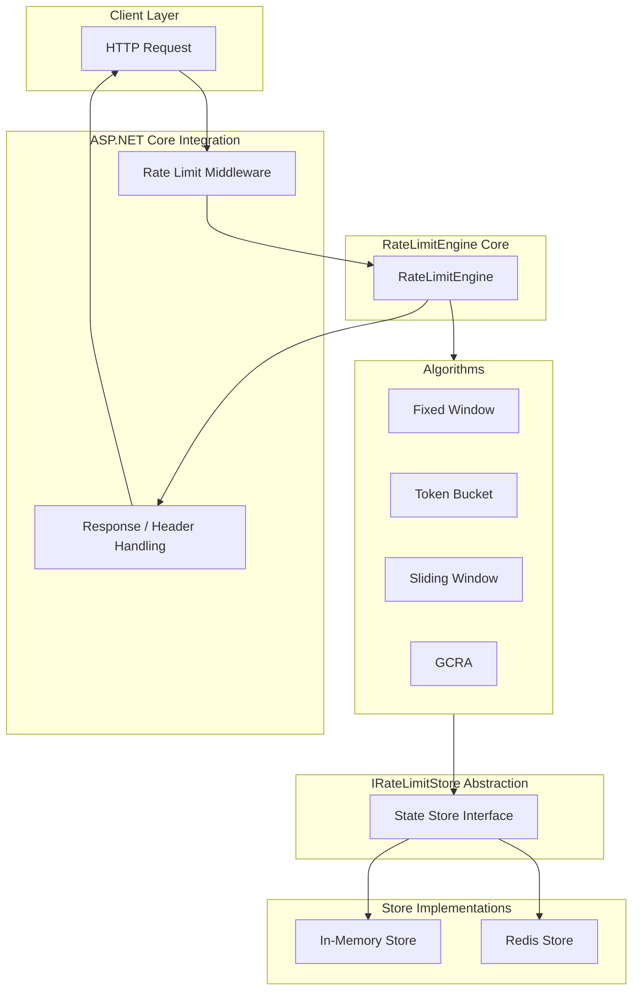
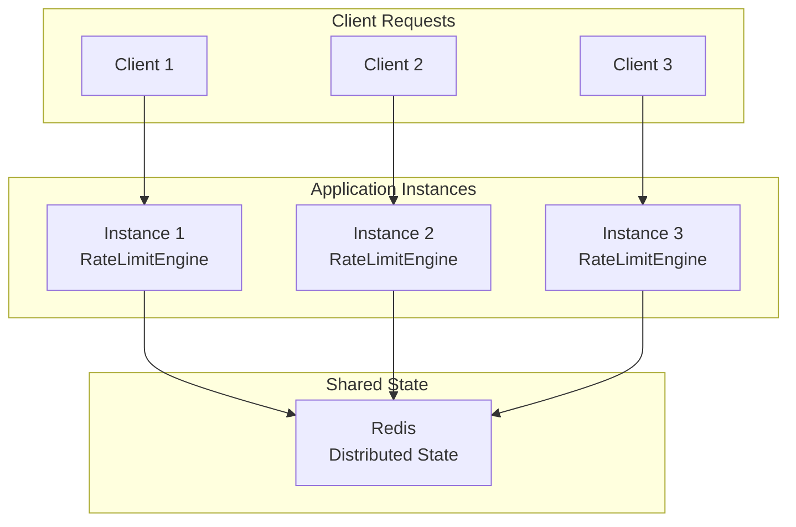

# RateLimitEngine

**A deeply engineered, extensible, and distributed rate limiting engine for .NET.**

RateLimitEngine is a production-oriented .NET library that implements multiple rate limiting algorithms with emphasis on correctness, concurrency safety, and distributed consistency. It provides both in-memory and Redis-backed state management, deep testing at concurrency boundaries, and explicit handling of failure modes. The project prioritizes demonstrating architectural trade-offs and measurable performance characteristics over feature proliferation.

---

## Why Rate Limiting?

Rate limiting is a critical infrastructure concern that serves multiple purposes: controlling the rate at which clients consume resources, protecting services from overload, enforcing fairness among competing clients, and managing burst traffic. However, correct implementation is non-trivial.

Engineering challenges include:

* **Concurrent access**: Multiple simultaneous requests compete for shared state; simple read-check-update sequences are unsafe.
* **Time boundary semantics**: Algorithm correctness depends on precise time handling and clock consistency.
* **Burst handling**: Different algorithms exhibit different burst characteristics; this affects client behavior and service stability.
* **Distributed deployments**: Multiple application instances must coordinate rate limit state without distributed transactions.
* **Atomicity and race conditions**: State transitions must be atomic; race conditions can silently violate rate limit guarantees.
* **Operational behavior**: Infrastructure failures (Redis unavailability, timeouts, network partitions) must result in deterministic, documented behavior.

A properly engineered rate limiter requires careful attention to each of these concerns.

---

## Project Goals

RateLimitEngine aims to demonstrate:

1. **Correct algorithm implementation** of multiple rate limiting strategies with verifiable semantics.
2. **Deterministic and testable behavior** independent of timing luck or hidden assumptions.
3. **Correct behavior under concurrency** with explicit race condition handling and atomic state transitions.
4. **Distributed rate limiting** using Redis to coordinate state across multiple application instances.
5. **Explicit atomicity and race condition handling** through careful abstraction and atomic operations.
6. **ASP.NET Core integration** that cleanly separates HTTP concerns from algorithm concerns.
7. **Reproducible benchmarking** using BenchmarkDotNet with precise measurement methodology.
8. **Load testing** to evaluate behavior under realistic workloads and concurrency levels.
9. **Clear architectural reasoning and trade-offs** documented through architecture decision records and design philosophy.

---

## Algorithms

RateLimitEngine implements the following algorithms:

### Fixed Window

Divides time into fixed intervals and allows a fixed number of requests per interval. Simple to implement and understand. Exhibits sharp boundary effects when request arrival aligns with window boundaries, allowing potential bursts at the transition between windows.

### Token Bucket

A continuous algorithm where tokens accumulate at a constant rate up to a maximum capacity. Requests consume tokens; a request proceeds if sufficient tokens are available. Supports burst traffic up to the bucket capacity while maintaining long-term rate control.

The mathematical model is:

$$T(t) = \min(C, \ T(t_0) + r(t - t_0))$$

where:
* $C$ = bucket capacity (maximum available tokens)
* $r$ = refill rate (tokens per unit time)
* $T(t)$ = available tokens at time $t$

Requests may consume tokens according to their configured cost, allowing differentiation between request types.

### Sliding Window

Counts requests within a continuously shifting time window. Eliminates boundary effects present in Fixed Window but requires more memory and computation to track individual request timestamps or exponentially-weighted counts.

### GCRA (Generic Cell Rate Algorithm)

A theoretical arrival time algorithm commonly used in telecommunications. Maintains a theoretical arrival time (TAT) that advances by the inverse of the rate limit. A request is allowed if the current time is at or after the TAT; the TAT is updated after each decision. Provides smooth rate limiting without boundaries.

### Algorithm Comparison

The repository compares algorithms across:

* **Correctness**: Adherence to defined rate limit semantics.
* **Time semantics**: Handling of clock precision, monotonicity, and boundary conditions.
* **Burst behavior**: Interaction between capacity/window size and burst characteristics.
* **Memory characteristics**: Storage requirements for state (per-client or global).
* **Concurrency implications**: Atomicity requirements and synchronization complexity.
* **Distributed implementation complexity**: Redis operations needed, atomic script requirements.

---

## Architecture

The project follows a layered architecture with clear separation of concerns:



Key architectural properties:

* **Core abstractions** are independent of storage concerns; algorithms do not depend directly on Redis.
* **Algorithm implementations** are separated from HTTP concerns; rate limit logic is framework-agnostic.
* **Storage is abstracted** behind `IRateLimitStore`, allowing in-memory and distributed implementations.
* **Dependency inversion** ensures algorithms depend on abstractions, not concrete storage implementations.
* **Redis serves infrastructure purposes**: providing shared state for distributed deployments, not core algorithm logic.

---

## Design Principles

The project applies the following engineering principles:

* **Separation of concerns**: Algorithms, storage, HTTP handling, and concurrency control are distinct layers.
* **Dependency inversion**: Depend on abstractions (interfaces) rather than concrete implementations.
* **Explicit abstractions**: Time, state, and concurrency are represented as explicit, testable abstractions.
* **Testability**: Design choices prioritize the ability to test behavior deterministically.
* **Deterministic time handling**: The system abstracts time as an injectable dependency to enable reproducible testing.
* **Concurrency correctness**: Race conditions and atomic state transitions are explicit design concerns, not accidental byproducts.
* **Minimal and justified design patterns**: SOLID principles and patterns are applied only where they solve real design problems.
* **Small, cohesive components**: Each component has a single, well-defined responsibility.
* **Measurement instead of assumption**: Performance claims are based on reproducible benchmarks, not intuition or marketing.

Design patterns are tools, not dogma. The project uses them where they provide clarity and correctness, not because they appear in textbooks.

---

## Concurrency

Concurrency is a first-class design concern, not an afterthought.

The project addresses:

* **Multiple simultaneous requests**: Race conditions occur naturally when multiple threads or tasks access shared rate limit state simultaneously.
* **Shared mutable state**: Rate limit counters and timestamps are mutable state accessed concurrently.
* **Race conditions**: Simple sequences of read, check, and update operations are unsafe when interleaved.
* **Atomic state transitions**: Rate limit decisions must atomically read state, apply algorithm logic, and update state.
* **Thread safety**: In-memory implementations use appropriate synchronization primitives.
* **Contention**: High-concurrency scenarios require efficient synchronization to avoid bottlenecks.

Consider a naive implementation:

```
READ current_tokens
CHECK current_tokens >= required
UPDATE current_tokens -= required
```

Under concurrency, Thread A and Thread B may both read the same token count, both pass the check, and both update—violating the rate limit. Correct implementations must atomically combine the check and update, or use algorithmic approaches that avoid this race pattern entirely.

Concurrency correctness will be demonstrated through:

* Dedicated unit tests exercising concurrent scenarios.
* Explicit synchronization primitives with documented rationale.
* Integration tests with multiple threads contending for shared state.
* Distributed tests verifying consistency across Redis-coordinated instances.

---

## Distributed Rate Limiting

Single-instance rate limiting is insufficient for distributed systems. RateLimitEngine supports distributed rate limiting across multiple application instances:



Redis provides shared state that is visible to all application instances. All rate limit decisions are coordinated through a central Redis store, ensuring global consistency.

Distributed rate limiting requires addressing:

* **Atomic operations**: State reads and updates must be atomic to prevent race conditions across instances.
* **Race conditions**: Without atomicity, two instances might simultaneously observe the same state and both grant requests that collectively exceed the limit.
* **State expiration**: Rate limit state must expire automatically to prevent memory leaks and stale state accumulation.
* **Concurrent updates**: Multiple instances may update the same rate limit state; updates must be linearizable.
* **Distributed correctness**: The global rate limit must be enforced despite clock skew, network delays, and message reordering.

Redis Lua scripting and atomic Redis operations provide mechanisms to implement atomic state transitions across the network. These are implementation techniques; the architectural abstraction remains the `IRateLimitStore` interface.

---

## Failure Semantics

Infrastructure failures are inevitable. RateLimitEngine defines explicit failure modes:

### Fail Open

If the rate limit store becomes unavailable (Redis down, network timeout, exception), rate limiting is disabled and all requests are allowed. This prioritizes availability over rate limit enforcement.

### Fail Closed

If the rate limit store becomes unavailable, all requests are denied. This prioritizes strict rate limit enforcement over availability.

The project supports both modes as explicit configuration. Applications must choose the appropriate mode based on their requirements and operational posture.

Specific failure scenarios include:

* **Redis unavailable**: Connection cannot be established; all requests handle via fail mode.
* **Redis timeout**: Request to Redis exceeds the configured timeout; behavior determined by fail mode.
* **Redis exception**: Unexpected errors from Redis; deterministic behavior defined by fail mode.

The failure mode is documented, observable, and subject to tests that verify behavior under simulated failures.

---

## ASP.NET Core Integration

RateLimitEngine includes lightweight ASP.NET Core integration that cleanly separates HTTP concerns from rate limiting concerns.

The integration layer handles:

* **HTTP 429 (Too Many Requests) responses** when a request is rate limited.
* **Rate limit headers** that inform clients about their consumption and remaining capacity.
* **Retry-After headers** indicating when clients should retry after being rate limited.

Standard rate limit headers include:

```
X-RateLimit-Limit       : Maximum requests allowed in the window
X-RateLimit-Remaining   : Requests remaining in the current window
X-RateLimit-Reset       : Unix timestamp when the limit resets
Retry-After             : Seconds until the client should retry
```

HTTP-specific responsibilities remain in the middleware and response handling layers. Algorithm implementations do not depend on or reference HTTP semantics. This separation enables reuse of the same algorithms in non-HTTP contexts and simplifies testing of algorithm logic.

---

## Performance and Benchmarking

Performance claims are based on reproducible measurements using BenchmarkDotNet. The project measures:

* **Throughput**: Requests per second under various concurrency levels.
* **Latency**: Processing time per request, reported as P50, P95, and P99 percentiles.
* **Allocations**: Garbage collection pressure from per-request allocations.
* **Memory characteristics**: Long-term memory usage and GC collections.
* **In-Memory vs. Redis**: Comparative performance of local state management versus distributed coordination.

Benchmark reports must include:

* **Hardware**: CPU model, core count, cache characteristics.
* **Operating system**: Windows, Linux, macOS; kernel version.
* **.NET version**: Runtime and SDK version used.
* **Redis version**: If Redis benchmarks are included.
* **Concurrency level**: Number of concurrent threads or tasks.
* **Workload description**: Request distribution, rate limit configuration, key distribution.
* **Warm-up methodology**: Number of iterations before measurement begins.
* **Iteration methodology**: Total iterations, time per iteration.

Benchmark results are published in the repository with full context. Unsupported performance claims are avoided. No fake charts, fabricated results, or speculative extrapolations are included.

---

## Load Testing

The project includes load tests using k6 to evaluate behavior under realistic workloads.

Load tests simulate:

* **Low load**: Baseline single-threaded performance.
* **Sustained load**: Continuous traffic over extended duration.
* **High concurrency**: Many simultaneous connections or threads.
* **Burst traffic**: Sudden spikes to test burst capacity and burst behavior.
* **Multiple application instances**: Distributed scenarios with coordinated rate limits across instances.

Load tests verify:

* **Correctness under load**: Rate limits remain enforced despite high concurrency.
* **Stability**: Memory, CPU, and connection usage remain stable over time.
* **Failure handling**: Behavior is deterministic when Redis unavailable.
* **Distribution**: Rate limit enforcement is fair across clients.

Load test results complement benchmarks and provide evidence of behavior in realistic scenarios.

---

## Observability

The project includes basic observability through OpenTelemetry to provide visibility into rate limiting behavior in production.

Observability signals include:

* **Allowed requests**: Count of requests that passed the rate limit check.
* **Rejected requests**: Count of requests that exceeded the rate limit.
* **Processing latency**: Time spent in rate limit decision logic.
* **Store failures**: Exceptions or timeouts from the rate limit store.
* **Redis latency**: Round-trip time for Redis operations.

Observability is built into the core engine and naturally exposed through OpenTelemetry APIs. Applications integrate observability through standard OpenTelemetry collectors without special configuration.

The observability scope remains focused on RateLimitEngine behavior; broader observability platform design is outside the project scope.

---

## Testing Strategy

The project employs a layered testing strategy:

```
Unit Tests
    |
    +-- Algorithm correctness (expected behavior, boundary conditions)
    |
    +-- Time abstraction (clock manipulation, monotonicity)
    |
    +-- In-memory store implementation
    |
Integration Tests
    |
    +-- Redis store behavior
    |
    +-- Redis atomicity verification
    |
    +-- Failure mode handling (Redis unavailable, timeout)
    |
Concurrency Tests
    |
    +-- Race condition detection
    |
    +-- Concurrent access patterns
    |
    +-- Synchronization correctness
    |
Distributed Tests
    |
    +-- Multi-instance rate limit enforcement
    |
    +-- State consistency across instances
    |
    +-- Distributed failure scenarios
    |
Benchmarks
    |
    +-- Throughput characteristics
    |
    +-- Latency percentiles (P50, P95, P99)
    |
    +-- Allocation profiling
    |
    +-- Comparative performance (in-memory vs. Redis)
```

Tests verify behavior at boundaries (window edges, capacity limits, clock boundaries) and under pathological concurrency scenarios. The test suite is designed to catch subtle correctness issues that deterministic unit tests miss.

---

## Repository Structure

```
RateLimitEngine/
├── src/
│   ├── RateLimitEngine.Core/
│   │   ├── Abstractions/
│   │   ├── Models/
│   │   ├── Time/
│   │   └── Engine/
│   │
│   ├── RateLimitEngine.Algorithms/
│   │   ├── FixedWindow/
│   │   ├── TokenBucket/
│   │   ├── SlidingWindow/
│   │   └── GCRA/
│   │
│   ├── RateLimitEngine.Redis/
│   │   ├── RedisStore/
│   │   ├── Scripting/
│   │   └── Configuration/
│   │
│   └── RateLimitEngine.AspNetCore/
│       ├── Middleware/
│       ├── Configuration/
│       └── Headers/
│
├── tests/
│   ├── RateLimitEngine.UnitTests/
│   │   ├── AlgorithmTests/
│   │   ├── TimeTests/
│   │   └── StoreTests/
│   │
│   ├── RateLimitEngine.IntegrationTests/
│   │   ├── RedisTests/
│   │   └── FailureHandlingTests/
│   │
│   ├── RateLimitEngine.ConcurrencyTests/
│   │   ├── RaceConditionTests/
│   │   └── SynchronizationTests/
│   │
│   └── RateLimitEngine.DistributedTests/
│       └── MultiInstanceTests/
│
├── benchmarks/
│   └── RateLimitEngine.Benchmarks/
│       ├── AlgorithmBenchmarks/
│       ├── StoreBenchmarks/
│       └── Results/
│
├── load-tests/
│   └── k6/
│       ├── scenarios/
│       └── results/
│
├── samples/
│   └── AspNetCoreDemo/
│       └── Controllers/
│
├── docs/
│   ├── architecture/
│   ├── algorithms/
│   └── adr/
│       ├── 0001-project-scope.md
│       ├── 0002-core-abstractions.md
│       ├── 0003-time-abstraction.md
│       ├── 0004-algorithm-selection.md
│       ├── 0005-concurrency-model.md
│       ├── 0006-redis-atomicity.md
│       ├── 0007-failure-semantics.md
│       └── 0008-aspnetcore-integration.md
│
├── .github/
│   └── workflows/
│       ├── build.yml
│       ├── test.yml
│       └── benchmark.yml
│
├── README.md
├── LICENSE
└── .gitignore
```

---

## Scope

The first major release focuses on:

* Rate limiting algorithms (Fixed Window, Token Bucket, Sliding Window, GCRA)
* Shared contracts and abstractions (IRateLimitStore, ITimeProvider, decision models)
* Time abstraction enabling deterministic testing
* In-memory state management with concurrency safety
* Redis-backed state for distributed deployments
* Concurrency correctness through atomic operations and synchronization
* Distributed correctness across multiple application instances
* Explicit failure semantics (Fail Open, Fail Closed)
* ASP.NET Core middleware and header integration
* Reproducible benchmarking with BenchmarkDotNet
* Load testing with k6
* Basic observability through OpenTelemetry
* CI/CD pipeline for testing, benchmarking, and validation
* Comprehensive documentation including algorithms, architecture, and decisions

---

## Non-Goals

The project is explicitly NOT intended to become:

* **A full API gateway**: RateLimitEngine is a rate limiting library, not an ingress controller or gateway implementation.
* **A SaaS rate limiting platform**: The project is an open-source library, not a cloud service.
* **An authentication system**: Authentication and identity are outside the scope.
* **An authorization system**: Access control and permissions are outside the scope.
* **A Kubernetes platform**: Kubernetes integration and operators are not planned.
* **A multi-language SDK ecosystem**: The project targets .NET; other language SDKs are not planned.
* **A cloud-specific deployment framework**: The project avoids cloud-specific dependencies.
* **A general-purpose distributed systems framework**: The project focuses narrowly on rate limiting correctness.

Scope control is essential for depth. The project prioritizes engineering excellence in rate limiting over feature breadth.

---

## Architectural Documentation

Important architectural decisions are documented as Architecture Decision Records (ADRs) in the `docs/adr/` directory.

ADRs capture:

* Context and problem statement
* Proposed solution and alternatives considered
* Rationale for the chosen approach
* Consequences and trade-offs
* Related decisions

Example ADR topics:

* Project scope and non-goals
* Core abstractions (IRateLimitStore, ITimeProvider)
* Time abstraction for deterministic testing
* Algorithm selection and comparison criteria
* Concurrency model and synchronization strategy
* Redis atomicity and Lua scripting approach
* Failure semantics (Fail Open vs. Fail Closed)
* ASP.NET Core integration and HTTP concerns

ADRs serve as both decision history and onboarding documentation for future contributors.

---

## Project Status

The repository is currently in the **foundation and architecture phase**. Core abstractions, interfaces, and design principles are being established. Algorithm implementations, storage backends, and integration layers are planned for subsequent phases.

The project does not yet include fully completed feature implementations. The README describes the intended architecture and scope; construction is ongoing.

---

## Roadmap

The project follows a phased development approach:

1. **Foundation**: Repository structure, build system, basic project setup.
2. **Domain & Contracts**: Core abstractions (IRateLimitStore, decision models, rate limit identifiers).
3. **Algorithms**: Implementation of Fixed Window, Token Bucket, Sliding Window, and GCRA.
4. **Concurrency**: Thread-safe in-memory store, synchronization, race condition testing.
5. **Redis Distribution**: Redis store implementation, atomic operations, multi-instance coordination.
6. **Distributed Correctness**: Distributed testing, consistency verification, failure scenario handling.
7. **Failure Semantics**: Fail Open and Fail Closed modes, deterministic behavior under failures.
8. **ASP.NET Core Integration**: Middleware, HTTP headers, 429 responses, Retry-After.
9. **Benchmarking**: BenchmarkDotNet setup, throughput and latency profiling, allocation analysis.
10. **Load Testing**: k6 scenario setup, sustained load testing, burst and concurrency evaluation.
11. **Observability**: OpenTelemetry integration, standard signals, collector configuration.
12. **CI/CD**: GitHub Actions workflows for build, test, benchmark, and documentation.
13. **Documentation**: Architecture decision records, algorithm guides, integration examples, contribution guidelines.
14. **v1.0 Release**: Stable API, comprehensive testing, performance baselines, production maturity.

---

## Design Philosophy

> **Correctness first.**
> **Distribution second.**
> **Performance measured, not assumed.**

RateLimitEngine prioritizes deep engineering over feature accumulation. Correctness means algorithms behave as specified, concurrency is safe, and failures are handled deterministically. Distribution means the system correctly coordinates state across instances. Performance means measurements are reproducible and claims are substantiated.

The project embraces explicit architectural trade-offs: simpler designs are preferred when they achieve correctness, even if they cost performance that can be optimized later with measurement. Conversely, performance optimizations are justified only by benchmarks, not by intuition or theoretical models.

The ideal outcome is a rate limiting library that engineers trust to work correctly, understand deeply through clear design, and tune confidently through reproducible measurements.

---

## License

MIT License
